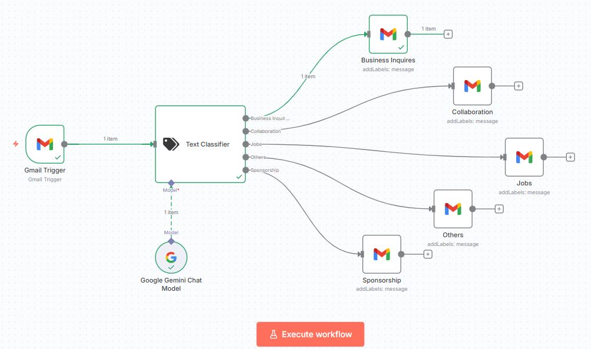
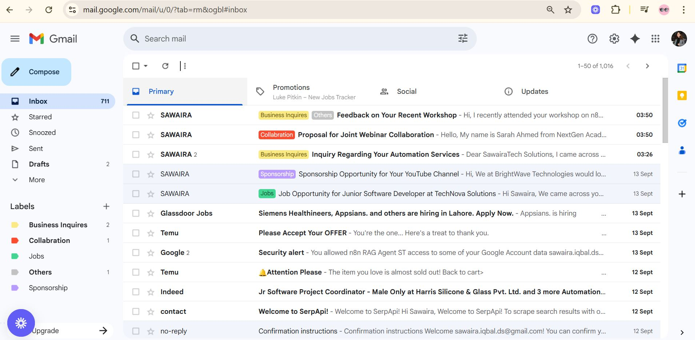

# 📧 Gmail Auto-Labeling Agent – n8n

An **AI-powered Gmail Labeling Agent** built with **n8n** and **Google Gemini**, designed to automatically classify and label incoming emails into categories like **Business Inquiries, Collaboration, Jobs, Sponsorship, and Others**.  



---

## 🌟 Features
- 📥 **Automated Email Classification** – Labels emails in real-time  
- 🤖 **AI-Powered Categorization** using Google Gemini (Text Classification)  
- 🏷️ **Custom Labels**: Business Inquiries, Collaboration, Jobs, Sponsorship, Others  
- 🔄 **Seamless Gmail Integration** via n8n Gmail Trigger  
- ⚡ **Fully Automated Workflow** – no manual sorting required  
- 📊 **Scalable Setup** – easily add more labels/categories  

---

## 🛠️ Tech Stack
- [n8n](https://n8n.io/) – Workflow automation  
- [Google Gemini](https://ai.google.dev/) – AI text classification  
- [Gmail API](https://developers.google.com/gmail/api) – Email fetching and labeling  

---

## 🧩 Workflow Overview
1. **Gmail Trigger** – Listens for new incoming emails.  
2. **Text Classifier (Gemini)** – Reads the email subject/body and classifies it.  
3. **Conditional Paths** – Routes emails into categories.  
4. **Gmail Labeling** – Adds labels automatically.  

---

## 📂 Categories
- **Business Inquiries** – Emails about services, quotes, or company-related queries.  
- **Collaboration** – Partnership or webinar collaboration requests.  
- **Jobs** – Hiring opportunities, job offers, and career-related emails.  
- **Sponsorship** – Emails offering sponsorships, ads, or promotions.  
- **Others** – General or uncategorized emails.  

---

## 📸 Screenshots

### Workflow in n8n


### Example – Classified Emails in Gmail


---

## 🚀 How to Use
1. Clone this repo:  
   ```bash
   git clone https://github.com/your-username/gmail-labeling-agent.git
   cd gmail-labeling-agent

